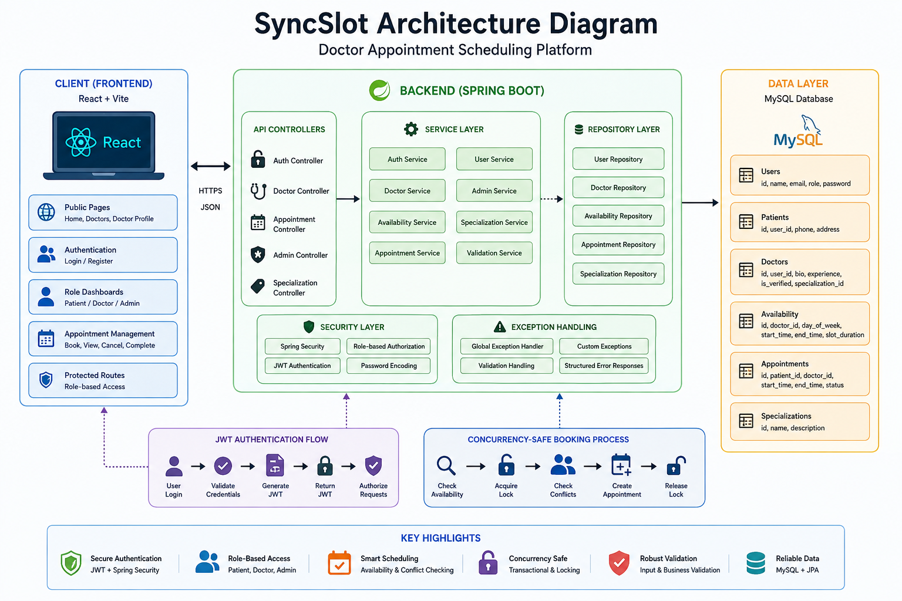

# 🔗 SyncSlot — Doctor Appointment Scheduling Platform

🚀 A full-stack doctor appointment scheduling platform that allows patients to discover doctors, check availability, book appointments, and manage their appointments securely.

---

## 🏗️ Project Overview

SyncSlot is built with **Spring Boot, React, MySQL, Spring Security, and JWT**.

It provides secure authentication, role-based access control, doctor management, availability management, appointment booking, and concurrency-safe appointment scheduling.

The platform supports three roles:

* **Patient**
* **Doctor**
* **Admin**

---

## 🏛️ Architecture Diagram



## 🌟 Features

### 🔐 Authentication & Authorization

* User registration and login
* JWT-based authentication
* Spring Security
* Role-based authorization
* Secure password hashing
* Protected API endpoints
* Patient, Doctor, and Admin roles

### 👨‍⚕️ Doctor Management

* Browse verified doctors
* View doctor profiles
* View doctor specializations
* View doctor availability
* Doctors can manage their availability
* Doctors can manage their appointments

### 📅 Appointment Management

* Book doctor appointments
* Check doctor availability
* Date and time validation
* Appointment cancellation
* Appointment completion
* Patient appointment history
* Doctor appointment management
* Prevention of overlapping appointments

### ⚡ Concurrency-Safe Booking

* Transactional appointment booking
* Pessimistic database locking
* Concurrent booking protection
* Conflict detection
* Prevents double booking of the same time slot

### 🛡️ Admin Management

* Admin dashboard
* View doctors
* Verify doctors
* View appointments
* Manage specializations

### 🚨 Exception Handling

* Global exception handling
* Resource-not-found handling
* Appointment conflict handling
* Validation error handling
* Access-denied handling

---

## 🧰 Tech Stack

| **Category** | **Technologies**           |
| ------------ | -------------------------- |
| Frontend     | React, JavaScript, Vite    |
| Backend      | Java, Spring Boot          |
| Database     | MySQL                      |
| Security     | Spring Security, JWT       |
| ORM          | Spring Data JPA, Hibernate |
| Validation   | Jakarta Bean Validation    |
| HTTP Client  | Axios                      |
| Routing      | React Router               |
| UI Icons     | Lucide React               |
| Build Tool   | Maven                      |

---

# 📁 Project Structure

```text
SyncSlot/
│
├── SyncSlot Backend/
│   ├── src/
│   │   └── main/
│   │       ├── java/com/syncslot/
│   │       │   ├── config/
│   │       │   ├── controller/
│   │       │   ├── dto/
│   │       │   ├── entity/
│   │       │   ├── enums/
│   │       │   ├── exception/
│   │       │   ├── repository/
│   │       │   ├── security/
│   │       │   ├── service/
│   │       │   └── SyncSlotApplication.java
│   │       │
│   │       └── resources/
│   │           └── application.properties
│   │
│   ├── pom.xml
│   └── mvnw
│
├── SyncSlot Frontend/
│   ├── src/
│   │   ├── components/
│   │   ├── context/
│   │   ├── layouts/
│   │   ├── pages/
│   │   │   ├── auth/
│   │   │   ├── patient/
│   │   │   ├── doctor/
│   │   │   └── admin/
│   │   ├── services/
│   │   ├── utils/
│   │   ├── App.jsx
│   │   ├── main.jsx
│   │   └── index.css
│   │
│   ├── package.json
│   └── vite.config.js
│
└── README.md
```

---

## ⚙️ How SyncSlot Works

1. User registers or logs in.
2. Spring Security authenticates the user and generates a JWT.
3. The user receives access according to their role.
4. Patients browse verified doctors.
5. Patients select a doctor and check available slots.
6. The system validates the doctor's availability.
7. The appointment request checks for existing conflicts.
8. A database transaction with locking protects the booking process.
9. The appointment is successfully created.
10. Doctors and patients can manage their appointments through their respective dashboards.

---

## 🔌 API Reference

### 🔐 Authentication

| **Method** | **Endpoint**         | **Purpose**           |
| ---------- | -------------------- | --------------------- |
| `POST`     | `/api/auth/register` | Register user         |
| `POST`     | `/api/auth/login`    | Login and receive JWT |

### 👨‍⚕️ Doctors

| **Method** | **Endpoint**                             | **Purpose**             |
| ---------- | ---------------------------------------- | ----------------------- |
| `GET`      | `/api/doctors`                           | Get verified doctors    |
| `GET`      | `/api/doctors/{id}`                      | Get doctor profile      |
| `GET`      | `/api/doctors/{id}/availability`         | Get doctor availability |
| `POST`     | `/api/doctor/availability`               | Set doctor availability |
| `GET`      | `/api/doctor/appointments`               | Get doctor appointments |
| `PUT`      | `/api/doctor/appointments/{id}/complete` | Complete appointment    |

### 📅 Appointments

| **Method** | **Endpoint**             | **Purpose**                |
| ---------- | ------------------------ | -------------------------- |
| `POST`     | `/api/appointments`      | Book appointment           |
| `GET`      | `/api/appointments/me`   | Get patient's appointments |
| `DELETE`   | `/api/appointments/{id}` | Cancel appointment         |

### 🛡️ Admin

| **Method** | **Endpoint**                     | **Purpose**           |
| ---------- | -------------------------------- | --------------------- |
| `GET`      | `/api/admin/doctors`             | Get all doctors       |
| `PUT`      | `/api/admin/doctors/{id}/verify` | Verify doctor         |
| `GET`      | `/api/admin/appointments`        | Get all appointments  |
| `POST`     | `/api/admin/specializations`     | Create specialization |

---

## 🖥️ User Roles

### 🧑 Patient

* Register and login
* Browse verified doctors
* View doctor profiles
* Check availability
* Book appointments
* View appointments
* Cancel appointments

### 👨‍⚕️ Doctor

* Login securely
* Manage availability
* View appointments
* Complete appointments
* Manage doctor profile

### 👑 Admin

* Manage doctors
* Verify doctors
* View appointments
* Manage specializations

---

## 🚀 How to Run Locally

### Backend

Navigate to the backend:

```bash
cd "SyncSlot Backend"
```

Configure your MySQL database and JWT settings in:

```text
src/main/resources/application.properties
```

Required:

```text
Java 17+
MySQL
Maven
```

Run the backend:

```bash
./mvnw spring-boot:run
```

On Windows:

```bash
mvnw.cmd spring-boot:run
```

The backend runs on:

```text
http://localhost:8081
```

### Frontend

Navigate to the frontend:

```bash
cd "SyncSlot Frontend"
```

Install dependencies:

```bash
npm install
```

Start the development server:

```bash
npm run dev
```

Frontend runs using **Vite**.

---

## 🔐 Security Notes

* JWT is used for authentication.
* Spring Security handles authorization.
* Passwords are securely hashed.
* Role-based access controls protected endpoints.
* Patient and doctor resources are validated against the authenticated user.
* Never commit database passwords.
* Never commit JWT secrets.
* Use environment variables for sensitive configuration.

---

## ✨ Future Enhancements

* Email appointment notifications
* WhatsApp appointment reminders
* Online payment integration
* Appointment rescheduling
* Doctor ratings and reviews
* Advanced doctor search and filtering
* Calendar integration
* Prescription management
* Medical document uploads
* Video consultation
* Redis caching
* Notification system

---

## 👨‍💻 Author

**Priyanshu Kashyap**

B.Tech CSE Student | Java & Spring Boot Developer

GitHub: https://github.com/Priyanshu462003

---

⭐ If you find **SyncSlot** useful, consider starring the repository!

### 📅 SyncSlot

**Find doctors. Check availability. Book appointments.**

Built with ❤️ using **Java, Spring Boot, React, MySQL, Spring Security & JWT**.
